# SentinelGraph

> **Stop the ring. Spare the customer.**  
> A defense-only Decision Firewall for coordinated payment abuse.

[](https://sentinelgraph-risk-commander.vercel.app)


**Live product:** https://sentinelgraph-risk-commander.vercel.app

SentinelGraph sits between a fraud signal and the action a merchant executes. It asks a question that transaction classifiers usually ignore:

> If we act on this signal, which legitimate customers could be affected—and what is the smallest reversible action we are actually allowed to take?

A merchant can submit payment context, inspect the temporal relationship graph, and propose a card-, address-, or component-wide block. SentinelGraph calculates that proposal's blast radius and deterministically rewrites excessive authority into transaction-level `allow`, `review`, or temporary `hold` actions. Every decision exposes its evidence, cost assumptions, failure state, authority boundary, and audit receipt.

This is a **Track 02 — AI Risk Manager** submission. It detects and contains payment abuse; it does not generate attack payloads, evasion strategies, identities, or offensive tooling.

## The core product claim

The default held-out incident demonstrates why a decision firewall matters:

| Proposed merchant action | Server-enforced result |
|---|---|
| Block a shared card profile | Transform into transaction-level containment |
| 5 connected payments affected | 3 sent to review, 0 automatically held |
| ₹1,49,395.85 of replay volume frozen | ₹95,445.85 of known-legitimate replay volume spared |
| One broad entity identity | Separate SHA-256 identities for requested and enforced contracts |

Resolved labels are used only to evaluate collateral damage after the replay. They are not available to the live action policy or included in either decision identity.

## Why this is not another fraud-score dashboard

1. **It changes the action, not just the score.** The server resolves the proposed entity against the graph, enumerates the affected payments, and compiles the smallest permitted plan.
2. **It prices false positives.** Review capacity, analyst cost, customer-friction cost, chargeback cost, and exposure are visible scenario controls—not hidden inside a threshold.
3. **It can refuse automation.** Drift, unavailable graph/model evidence, and missing identity produce `REVIEW` or `PAUSE`, never an invented zero-risk answer.
4. **The AI cannot move money.** Retrieval and an optional LLM draft an analyst brief; deterministic policy and permission gates own the decision.
5. **Failures are demonstrable.** Tampered signatures, duplicate webhooks, out-of-order lifecycle events, prompt injection, stale graph evidence, and excessive action scope all have explicit recovery paths.

## Product workflow

```mermaid
flowchart LR
    A[Signed payment event] --> B{Ingress verifier}
    B -->|tampered / duplicate| X[Reject before mutation]
    B -->|valid| C[Canonical transaction]
    C --> D[Transaction risk]
    C --> E[Past-only entity graph]
    D --> F[Calibrated contextual risk]
    E --> F
    F --> G[Expected-cost policy]
    G --> H{Decision Firewall}
    H -->|scope allowed| I[Allow / Review / Hold]
    H -->|entity-wide scope| J[Rewrite to transaction plan]
    I --> K[Evidence packet + audit hash]
    J --> K
    K --> L[Hybrid policy retrieval]
    L --> M[Optional Gemini draft]
    M --> N[Citation + authority gate]
    N --> O[Analyst brief]
```



## What is live, and what is packaged

The repository deliberately separates the public product runtime from the reproducible research runtime.

| Surface | What runs | State boundary |
|---|---|---|
| **Vercel product console** (`app/`, `public/`) | Live merchant-batch validation, entity tokenisation, graph construction, cost-policy compilation, containment rewriting, failure injection, analyst feedback, webhook simulations, cited copilot fallback, and hash-chain verification | Session-scoped signed cookie; no secret or customer data is embedded |
| **Locked evaluation artifacts** (`data/`) | Metrics and a deterministic eight-event incident derived from the final chronological IEEE-CIS test partition | Packaged read-only evidence; the hosted console does not claim live joblib inference |
| **Python research runtime** (`python/`) | Dataset build, leakage-safe temporal features, model training, isotonic calibration, masked relationship re-scoring, policy/RAG evaluation, Razorpay webhook contract, local reference server, and 39 tests | Local artifacts and optional environment-only credentials |

The public deployment intentionally contains **no Gemini or Razorpay secrets**. Its copilot uses the same deterministic cited fallback that handles a missing model key. Razorpay configuration status is reported honestly; valid gateway events are not forced into the IEEE-CIS model when required merchant-history and identity features are absent.

## Measured evaluation

Evaluation uses **590,540 real labelled IEEE-CIS/Vesta e-commerce transactions** with a stable chronological **70/15/15** train/calibration/test split. The final **88,581 rows** are locked test data.

| Measurement | Transaction only | + temporal graph | Interpretation |
|---|---:|---:|---|
| Average precision | 0.4499 | 0.4575 | Point estimate improves |
| Paired moving-block 95% CI for AP delta | — | −0.0014 to +0.0171 | Crosses zero; aggregate lift is reported as inconclusive |
| Recall at 1% risk-ranked queue | 24.72% | 24.62% | Graph catches 759 frauds vs 762; it does not win here |
| False positives at 1% queue | 123 | 126 | ₹14,760 vs ₹15,120 at the declared ₹120 review cost |
| Precision at 0.25% capacity | 86.4% | 91.4% | A predeclared operating point where graph context helps |

The operational expected-loss queue uses:

```text
P(fraud) × (INR-normalized transaction amount + ₹1,500 chargeback fee)
```

At the same 885-review budget, it changes captured exposure from **₹4.61m / 11.8% across 759 fraud cases** to **₹13.04m / 33.4% across 394 fraud cases**. This is an explicit value-versus-case tradeoff, not a claim that the model became more accurate.

The balanced merchant-objective scenario reports ₹11.99m of evaluated graph-queue value versus ₹11.16m for the baseline (**+₹820,762**); at 0.25% capacity the simulator recommends the baseline. These are locked-outcome scenario calculations, not realized merchant savings.

### Financial-unit boundary

IEEE-CIS defines `TransactionAmt` in **USD**. Raw USD stays in the model. Before any queue economics or rupee display, SentinelGraph applies a documented fixed scenario conversion of **$1 = ₹83**, locked on 2026-08-23. It is a normalization assumption—not a historical FX observation.

### Leakage controls

- stable chronological split by `TransactionDT` and `TransactionID`;
- score the current event **before** inserting it into graph state;
- confirmed fraud labels become visible only after a configurable 24-hour delay;
- isotonic calibration is fitted on validation data only;
- paired 1,024-event moving-block bootstrap preserves local fraud bursts;
- graph rescue examples come only from held-out rows under one predeclared selector.

## AI-native design

| Job | Technique | Why this boundary exists |
|---|---|---|
| Rare-event risk | Histogram gradient boosting | Strong, reproducible tabular baseline |
| Relational context | Past-only temporal graph features | Coordinated abuse is relational; a whole-dataset graph leaks the future |
| Decision-ready probability | Validation-only isotonic calibration | Expected-cost actions require calibrated probability |
| Relationship explanation | Mask and re-score | Measures local sensitivity without claiming causality |
| Money-impacting action | Deterministic expected-cost policy | Financial authority must remain inspectable and bounded |
| Policy selection | Word/bigram TF-IDF + BM25 fusion | Small corpus; routing quality can be measured directly |
| Analyst synthesis | Optional Gemini structured draft | Language generation helps summarize but receives no payment tools |
| Generated-claim validation | Evidence-ID and authority equality gate | Invalid, unsupported, or over-authorized output is discarded |

The 12-question labelled policy-routing set reports **100% Recall@3** and **0.944 MRR**, including an adversarial question asking the system to ignore policy and block every customer sharing a device. This is a small developer-authored routing evaluation, not a claim of production answer quality.

LangChain is intentionally absent. A direct typed model adapter, inspectable retriever, deterministic validator, and fixed permission boundary are easier to audit than a general orchestration layer for this workflow.

## Failure recovery

| Failure | Safe behavior |
|---|---|
| Model unavailable | Suppress the score; route to review |
| Graph timeout | Remove ring-level explanations; route to review |
| Missing device/address identity | Keep transaction context; disable automated graph containment |
| PSI ≥ 0.25 | Pause automatic action |
| Evidence compiler unavailable | Preserve bounded policy result; suppress unsupported prose |
| Entity-wide block request | Reject and compile a transaction-scoped plan |
| Tampered webhook | Reject before parsing or model execution |
| Duplicate event ID | Reject before mutation |
| Out-of-order lifecycle event | Audit it; refuse state regression |
| Invalid LLM citations/action | Discard generation; use deterministic cited fallback |
| Analyst reversal | Update only incident-linked state and append a new audit receipt |

## Architecture and repository map

```text
SentinelGraph/
├── app/
│   ├── api/[...path]/route.ts   # Vercel API and safety contracts
│   └── page.tsx                 # Redirect into the operator console
├── public/
│   ├── workbench.html           # Five-workspace risk console
│   └── app.js                   # Interactive replay and workbench client
├── data/
│   ├── sentinel_metrics.json    # Locked evaluation results
│   ├── incident.json            # Held-out replay fixture
│   └── rag_eval.json            # Labelled retrieval evaluation
├── python/
│   ├── build_sentinelgraph.py   # Full training/evaluation pipeline
│   ├── riskpilot/               # Policy, containment, RAG, feedback, monitoring
│   ├── tests/                   # 39 defense and correctness tests
│   ├── artifacts/               # Packaged model/evaluation bundles
│   ├── scripts/                 # Failure, RAG, Razorpay and data verification
│   └── docs/adr/                # Architecture decisions
├── README.md
├── vercel.json
└── package.json
```

## Run the Vercel console locally

Requirements: Node.js 22 and pnpm.

```bash
pnpm install --frozen-lockfile
pnpm dev
```

Open http://localhost:3000. A production-equivalent check is:

```bash
pnpm lint
pnpm build
pnpm start
```

No environment variables are required for the public-demo behavior.

## Reproduce the Python evaluation

The repository includes the packaged demo bundles. Raw competition CSVs are deliberately excluded.

```bash
cd python
python -m venv .venv
# Windows: .venv\Scripts\activate
# macOS/Linux: source .venv/bin/activate
python -m pip install -r requirements.txt
python -m pytest -q
python server.py --port 8000
```

To rebuild from accepted Kaggle competition files:

```bash
cd python
python download_data.py
python build_sentinelgraph.py --data-dir data/raw
```

Official data source: https://www.kaggle.com/competitions/ieee-fraud-detection/data

The optional public mirror used during development lists no license. Production or commercial reuse requires a separate data-rights review. Raw data and credentials are excluded from Git.

## API surface

| Method | Route | Purpose |
|---|---|---|
| `GET` | `/api/health` | Runtime and artifact readiness |
| `GET` | `/api/metrics` | Locked evaluation, capacity, drift, and uncertainty metrics |
| `GET` | `/api/incident` | Reproducible held-out incident fixture |
| `POST` | `/api/workbench/compile` | Validate a merchant batch, tokenise entities, build a graph, and compile containment |
| `POST` | `/api/containment/preview` | Compare requested entity scope with the permitted transaction plan |
| `POST` | `/api/agent/decide` | Apply failure gates, authority validation, policy, and audit receipt |
| `POST` | `/api/feedback` | Record bounded analyst resolution |
| `GET` | `/api/audit/verify` | Recompute and verify the SHA-256 chain |
| `POST` | `/api/copilot/brief` | Retrieve policy, draft/fallback, validate citations and authority |
| `POST` | `/api/webhook/verify` | Exercise signature and replay outcomes in the hosted demo |
| `POST` | `/api/razorpay/simulate` | Demonstrate monotonic out-of-order state handling |

See [`python/API.md`](python/API.md) for the full reference-server contract.

## Five-minute demo path

1. **Overview:** establish the real dataset, locked split, false-positive economics, and currency boundary.
2. **Decision Firewall:** edit or add a payment, compile a fresh graph, and compare the proposed block with the server-enforced plan.
3. **Unsafe action:** attempt to block the shared device and show the deterministic rejection.
4. **AI copilot:** generate a cited brief and show retrieval scores, claim validation, and zero money authority.
5. **Failure recovery:** inject a graph timeout or tampered webhook, then verify the audit chain.

## Security and privacy

- Raw Razorpay request bodies are authenticated before parsing in the Python reference adapter.
- API-key and webhook secrets are separate environment variables.
- Entity values submitted to the hosted workbench are SHA-256 tokenised and not returned.
- Merchant batches are not persisted by the hosted compiler.
- Audit records include the previous digest and are verified as a chain.
- The public deployment stores compact demo audit/feedback state in a secure signed session cookie.
- No real customer data, raw IEEE-CIS CSV, Gemini key, Razorpay key, or webhook secret is committed.

For a complete abuse analysis, see [`python/THREAT_MODEL.md`](python/THREAT_MODEL.md) and the architecture decisions in [`python/docs/adr`](python/docs/adr).

## Honest limitations

1. IEEE-CIS is real anonymized Vesta commerce data, not current Indian UPI production traffic.
2. The hosted Vercel runtime replays locked evaluation artifacts; live joblib inference remains in the Python reference runtime.
3. Aggregate graph AP lift is inconclusive under the moving-block interval, and graph context loses at some review capacities.
4. Masked graph re-scoring is local model sensitivity, not causal explanation.
5. The fixed ₹83/USD conversion and merchant costs are declared scenarios, not observed historical economics or recovered money.
6. Missing device identity is a major cold-start weakness; that slice records only 1.0% recall at the global threshold.
7. Session-cookie state is appropriate for an isolated demo, not multi-analyst production persistence.
8. Production deployment requires authenticated analysts, transactional storage, durable idempotency, KMS-managed secrets, rate limits, and externally anchored audit logs.
9. The small RAG routing set must be expanded with real analyst questions before operational use.
10. Gemini processing requires provider/legal review and merchant consent before real payment evidence is transmitted.

## Buildathon alignment

- **Problem taste:** coordinated abuse is relational, but broad graph actions can punish legitimate customers.
- **Build quality:** native Next.js deployment, typed API contracts, reproducible Python pipeline, packaged artifacts, tests, threat model, and ADRs.
- **AI judgment:** ML estimates risk; RAG/LLM synthesize evidence; deterministic code owns financial authority.
- **Failure recovery:** the product visibly handles dependency failure, drift, invalid ingress, excessive scope, and analyst reversal.
- **Honest metrics:** chronological holdout, false-positive cost, operating-point comparisons, confidence interval, cold-start slices, and explicit limitations.

## Defense-only statement

SentinelGraph detects, verifies, and contains suspected payment abuse. It does not create fraudulent transactions, identities, payloads, evasion instructions, or other offense-capable functionality.

